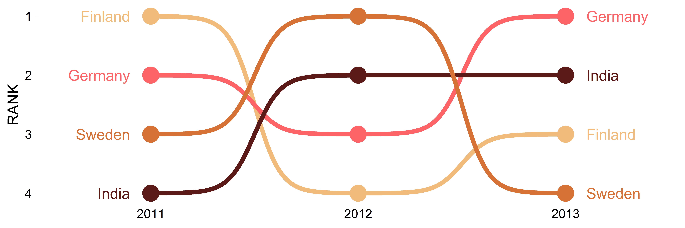
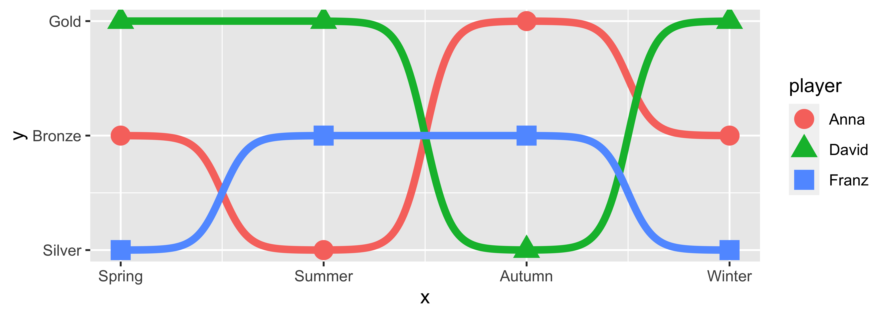
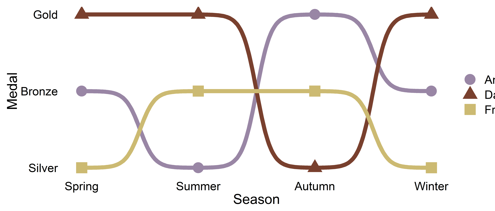

<!-- README.md is generated from README.Rmd. Please edit that file -->

# ggbump 

<!-- badges: start -->

<!-- badges: end -->

The R package `ggbump` creates elegant bump charts in ggplot. Bump
charts are good to use to plot ranking over time.

## Installation

You can install ggbump from CRAN with:

``` r
install.packages("ggbump")
```

Or the latest development version from
[github](https://github.com/davidsjoberg/ggbump) with:

``` r
devtools::install_github("davidsjoberg/ggbump")
```

## Bump chart Examples

Basic example:


A more advanced example:


[Click here for code to the plot
above](https://github.com/davidsjoberg/ggbump/wiki/My-year-on-Spotify)

Flags could be used instead of names:


[Click here for code to the plot
above](https://github.com/davidsjoberg/ggbump/wiki/geom_bump-with-flags)

With `geom_sigmoid` you can make custom sigmoid curves:


[Click here for code to the plot
above](https://github.com/davidsjoberg/ggbump/wiki/geom_sigmoid)

# Tutorial

## Prep

Load packages and get some data with rank:

``` r
if(!require(pacman)) install.packages("pacman")
library(ggbump)
pacman::p_load(tidyverse, cowplot, wesanderson)

df <- tibble(country = c("India", "India", "India", "Sweden", "Sweden", "Sweden", "Germany", "Germany", "Germany", "Finland", "Finland", "Finland"),
             year = c(2011, 2012, 2013, 2011, 2012, 2013, 2011, 2012, 2013, 2011, 2012, 2013),
             value = c(492, 246, 246, 369, 123, 492, 246, 369, 123, 123, 492, 369))

knitr::kable(head(df))
```

| country | year | value |
| :------ | ---: | ----: |
| India   | 2011 |   492 |
| India   | 2012 |   246 |
| India   | 2013 |   246 |
| Sweden  | 2011 |   369 |
| Sweden  | 2012 |   123 |
| Sweden  | 2013 |   492 |

To create a ranking column we use `rank` from base R. We specify
`ties.method = "random"` to make sure that each country have different
rankings if they have the same value.

``` r
df <- df %>% 
  group_by(year) %>% 
  mutate(rank = rank(value, ties.method = "random")) %>% 
  ungroup()

knitr::kable(head(df))
```

| country | year | value | rank |
| :------ | ---: | ----: | ---: |
| India   | 2011 |   492 |    4 |
| India   | 2012 |   246 |    2 |
| India   | 2013 |   246 |    2 |
| Sweden  | 2011 |   369 |    3 |
| Sweden  | 2012 |   123 |    1 |
| Sweden  | 2013 |   492 |    4 |

## Make a bump chart

Most simple use case:

``` r
ggplot(df, aes(year, rank, color = country)) +
    geom_bump()
```


## Pimp the bump chart\!

Improve the bump chart by adding:

  - A point for each rank observation.
  - Choose a minimal theme, I use `theme_minimal_grid()` from `cowplot`.
  - Choose nice colors so it does not look generic ggplot. I use a
    palette from `wesanderson`.
  - Remove legend and add labels at the start and end of the bumpy ride.
  - Reverse the y-axis to get rank 1 at the top.
  - Adjust the ‘smoothness’ of the lines by setting `smooth` to 8.
    Higher means less smooth.

<!-- end list -->

``` r

ggplot(df, aes(year, rank, color = country)) +
  geom_point(size = 7) +
  geom_text(data = df %>% filter(year == min(year)),
            aes(x = year - .1, label = country), size = 5, hjust = 1) +
  geom_text(data = df %>% filter(year == max(year)),
            aes(x = year + .1, label = country), size = 5, hjust = 0) +
  geom_bump(size = 2, smooth = 8) +
  scale_x_continuous(limits = c(2010.6, 2013.4),
                     breaks = seq(2011, 2013, 1)) +
  theme_minimal_grid(font_size = 14, line_size = 0) +
  theme(legend.position = "none",
        panel.grid.major = element_blank()) +
  labs(y = "RANK",
       x = NULL) +
  scale_y_reverse() +
  scale_color_manual(values = wes_palette(n = 4, name = "GrandBudapest1"))
```



## geom\_bump with factors

To use `geom_bump` with factors or character axis you need to prepare
the data frame before. You need to prepare one column for the numeric
position and one column with the name. If you want to have
character/factor on both y and x you need to prepare 4 columns.

``` r
# Original df
df <- tibble(season = c("Spring", "Summer", "Autumn", "Winter", 
                        "Spring", "Summer", "Autumn", "Winter", 
                        "Spring", "Summer", "Autumn", "Winter"),
             position = c("Gold", "Gold", "Bronze", "Gold",
                          "Silver", "Bronze", "Gold", "Silver",
                          "Bronze", "Silver", "Silver", "Bronze"),
             player = c(rep("David", 4),
                        rep("Anna", 4),
                        rep("Franz", 4)))

# Create factors and numeric columns
df <- df %>% 
  mutate(season = factor(season, 
                         levels = c("Spring", "Summer", "Autumn", "Winter")),
         x = as.numeric(season),
         position = factor(position, 
                           levels = c("Gold", "Silver", "Bronze")),
         y = as.numeric(position))

# Add manual axis labels to plot
p <- ggplot(df, aes(x, y, color = player)) +
  geom_bump(size = 2, smooth = 8, show.legend = F) +
  geom_point(size = 5, aes(shape = player)) +
  scale_x_continuous(breaks = df$x %>% unique(),
                     labels = df$season %>% levels()) +
  scale_y_reverse(breaks = df$y %>% unique(),
                     labels = df$position %>% levels())
p
```



### And some nice theme features

``` r
p +
  theme_minimal_grid(font_size = 14, line_size = 0) +
  theme(panel.grid.major = element_blank(),
        axis.ticks = element_blank()) +
  labs(y = "Medal",
       x = "Season",
       color = NULL,
       shape = NULL) +
  scale_color_manual(values = wes_palette(n = 3, name = "IsleofDogs1"))
```



## Feedback

If you find any error or have suggestions for improvements you are more
than welcome to contact me :)
