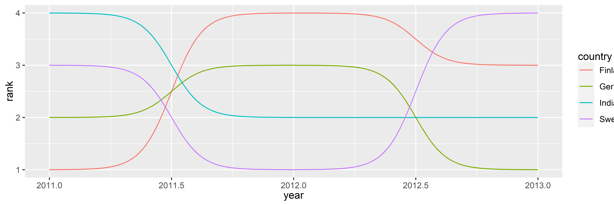

<!-- README.md is generated from README.Rmd. Please edit that file -->

# ggbump

<!-- badges: start -->

<!-- badges: end -->

The R package `ggbump` creates elegant bump charts in ggplot.Bump charts
are good to use to plot rankning over time.

## Installation

You can install the released version of ggbump from
[github](https://github.com/davidsjoberg/ggbump) with:

``` r
devtools::install_github("davidsjoberg/ggbump")
```

## Bump chart Example

This is a basic example which shows you how to solve a common problem:


## Prep

Load packages and get som data with rank:

``` r
if(!require(pacman)) install.packages("pacman")
library(ggbump)
pacman::p_load(tidyverse, cowplot, wesanderson)

df <- tibble(country = c("India", "India", "India", "Sweden", "Sweden", "Sweden", "Germany", "Germany", "Germany", "Finland", "Finland", "Finland"),
             year = c(2011, 2012, 2013, 2011, 2012, 2013, 2011, 2012, 2013, 2011, 2012, 2013),
             rank = c(4, 2, 2, 3, 1, 4, 2, 3, 1, 1, 4, 3))

knitr::kable(df)
```

| country | year | rank |
| :------ | ---: | ---: |
| India   | 2011 |    4 |
| India   | 2012 |    2 |
| India   | 2013 |    2 |
| Sweden  | 2011 |    3 |
| Sweden  | 2012 |    1 |
| Sweden  | 2013 |    4 |
| Germany | 2011 |    2 |
| Germany | 2012 |    3 |
| Germany | 2013 |    1 |
| Finland | 2011 |    1 |
| Finland | 2012 |    4 |
| Finland | 2013 |    3 |

## Make a bump chart

Most simple use case:

``` r
ggplot(df, aes(year, rank, color = country)) +
    geom_bump()
```



## Pimp the bump chart\!

Improve the bump chart by adding:

  - A point for each rank observation.
  - Choose a minimal theme, I use `theme_minimal_grid()` from `cowplot`.
  - Choose nice colors so it does not look generic ggplot. I use a
    palette from `wesanderson`.
  - Remove legend and add labels at the start and end of the bumpy ride.
  - Reverse the y-axis to get rank 1 at the top.
  - Adjust the ‘smoothness’ of the lines by setting the aestethic
    `smooth` to 8. Higher means less smooth.

<!-- end list -->

``` r
ggplot(df, aes(year, rank, color = country)) +
  geom_point(size = 7) +
  geom_text(data = df %>% filter(year == min(year)),
            aes(x = year - .1, label = country), size = 5, hjust = 1) +
  geom_text(data = df %>% filter(year == max(year)),
            aes(x = year + .1, label = country), size = 5, hjust = 0) +
  geom_bump(aes(smooth = 8), size = 2) +
  scale_x_continuous(limits = c(2010.6, 2013.4),
                     breaks = seq(2011, 2013, 1)) +
  theme_minimal_grid(font_size = 14, line_size = 0) +
  theme(legend.position = "none",
        panel.grid.major = element_blank()) +
  labs(y = "RANK",
       x = NULL) +
  scale_y_reverse() +
  scale_color_manual(values = wes_palette(n = 4, name = "GrandBudapest1"))
```


